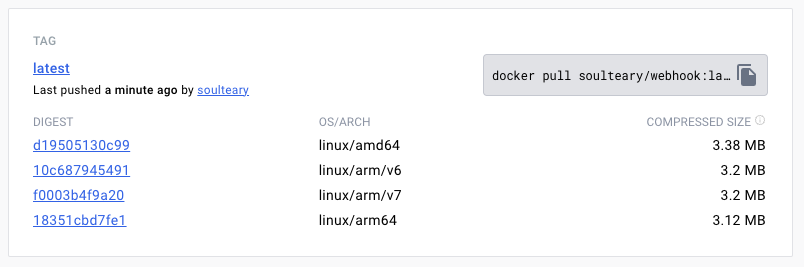
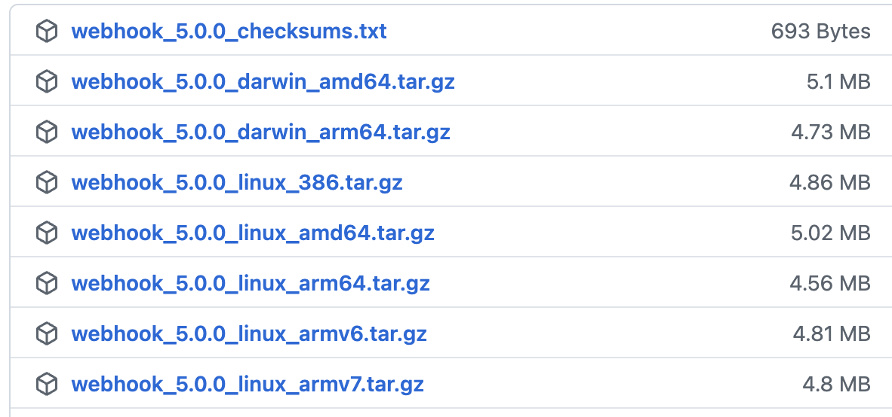

# 什么是 WebHook (歪脖虎克)?

[](https://github.com/soulteary/webhook/actions/workflows/build.yml) [](https://github.com/soulteary/webhook/actions/workflows/codeql.yml) [](https://github.com/soulteary/webhook/actions/workflows/scan.yml) [](https://goreportcard.com/report/github.com/soulteary/webhook)

 
 
 [webhook][w] 是一个用 Go 语言编写的轻量可配置实用工具，它允许你在服务器上轻松创建 HTTP 服务（钩子），你可以使用这些服务来执行配置好的命令。你还可以将 HTTP 请求中的数据（如请求头内容、请求体以及请求参数）传递给你配置好的命令。[webhook][w] 还允许根据具体的条件规则来便触发钩子。

例如，如果你使用的是 Github 或 Gitea，可以使用 [webhook][w] 设置一个钩子，在每次你推送更改到项目的某个分支时，这个钩子会在你的暂存服务器上运行一个重新部署脚本。

如果你使用 飞书、Mattermost 或 Slack，你可以设置一个“传出 Webhook 集成”或“斜杠命令”，来在你的服务器上运行各种命令，然后可以通过“传入 Webhook 集成”或处理合适的响应体，直接向你或你的 IM 会话或频道报告执行结果。

[webhook][w] 的目标只做它应该做的事情，那就是：

1.  接收请求，
2.  解析请求头、请求体和请求参数，
3.  检查钩子指定的运行规则是否得到满足，
4.  最后，通过命令行参数或环境变量将指定的参数传递给指定的命令。

其他的所有事情，都需要命令作者的来完成。

# 入门

## 软件安装

### Docker



你可以使用下面的任一命令来下载本仓库自动构建的可执行程序镜像：

```bash
docker pull soulteary/webhook:latest
docker pull soulteary/webhook:3.4.5
```

如果你希望镜像中有一些方便调试的工具，可以使用下面的命令，获取扩展版的镜像：

```bash
docker pull soulteary/webhook:extend-3.4.5
```

然后我们可以基于这个镜像来构建和完善我们命令所需要的运行环境。

**参考教程【TBD】**

### 下载预构建程序

[](https://github.com/soulteary/webhook/releases)

不同架构的预编译二进制文件可在 [GitHub 发布](https://github.com/soulteary/webhook/releases) 页面获取。

## 配置

我们可以来定义一些你希望 [webhook][w] 提供 HTTP 服务使用的钩子。

[webhook][w] 支持 JSON 或 YAML 配置文件，我们先来看看如何实现 JSON 配置。

首先，创建一个名为 hooks.json 的空文件。这个文件将包含 [webhook][w] 将要启动为 HTTP 服务的钩子的数组。查看 [Hook definition page](docs/Hook-Definition.md)，可以查看钩子可以包含哪些属性，以及如何使用它们的详细描述。

让我们定义一个简单的名为 redeploy-webhook 的钩子，它将运行位于 `/var/scripts/redeploy.sh` 的重新部署脚本。确保你的 bash 脚本在顶部有 `#!/bin/sh`。

我们的 hooks.json 文件将如下所示：

```json
[
  {
    "id": "redeploy-webhook",
    "execute-command": "/var/scripts/redeploy.sh",
    "command-working-directory": "/var/webhook"
  }
]
```

如果你更喜欢使用 YAML，相应的 hooks.yaml 文件内容为：

```yaml
- id: redeploy-webhook
  execute-command: "/var/scripts/redeploy.sh"
  command-working-directory: "/var/webhook"
```

接下来，你可以通过下面的命令来执行 [webhook][w]：

```bash
$ /path/to/webhook -hooks hooks.json -verbose
```

程序将在默认的 9000 端口启动，并提供一个公开可访问的 HTTP 服务地址：

```http
http://yourserver:9000/hooks/redeploy-webhook
```

查看 [webhook 参数](docs/Webhook-Parameters.md) 了解如何在启动 [webhook][w] 时设置 IP、端口以及其它设置，例如钩子的热重载，详细输出等。

当有任何 HTTP GET 或 POST 请求访问到服务地址后，你设置的重新部署脚本将被执行。

不过，像这样定义的钩子可能会对你的系统构成安全威胁，因为任何知道你端点的人都可以发送请求并执行命令。为了防止这种情况，你可以使用钩子的 "trigger-rule" 属性来指定触发钩子的确切条件。例如，你可以使用它们添加一个秘密参数，必须提供这个参数才能成功触发钩子。请查看 [Hook 规则](docs/Hook-Rules.md) 以获取可用规则及其使用方法的详细列表。

## 表单数据

[webhook][w] 提供了对表单数据的有限解析支持。

表单数据通常可以包含两种类型的部分：值和文件。
所有表单 _值_ 会自动添加到 `payload` 范围内。
使用 `parse-parameters-as-json` 设置将给定值解析为 JSON。
除非符合以下标准之一，否则所有文件都会被忽略：

1.  `Content-Type` 标头是 `application/json`。
2.  部分在 `parse-parameters-as-json` 设置中被命名。

在任一情况下，给定的文件部分将被解析为 JSON 并添加到 payload 映射中。

## 模版

当使用 `-template` [命令行参数](docs/Webhook-Parameters.md)时，[webhook][w] 可以将钩子配置文件解析为 Go 模板。有关模板使用的更多详情，请查看[模版](docs/Templates.md)。

## 使用 HTTPS

[webhook][w] 默认使用 http 提供服务。如果你希望 [webhook][w] 使用 https 提供 HTTPS 服务，更简单的方案是使用反向代理或者使用 traefik 等服务来提供 HTTPS 服务。

## 跨域 CORS 请求头

如果你想设置 CORS 头，可以在启动 [webhook][w] 时使用 `-header name=value` 标志来设置将随每个响应返回的适当 CORS 头。

## 使用示例

查看 [Hook 示例](docs/Hook-Examples.md) 来学习各种新鲜的使用。

# 为什么要作一个开源软件的分叉

主要有两个原因：

1. 作者维护的版本是从比较陈旧的版本升级上来的，包含了许多不再被需要的内容，我在几年前曾经提交过一个[改进版本的 PR](https://github.com/adnanh/webhook/pull/570)，但是因为种种原因被作者忽略，**与其继续使用明知道不可靠的程序，不如将它变的可靠。**
2. 除了更容易从社区合并未被原始仓库作者合并的社区功能外，还可以快速对有安全风险的依赖作更新，以及我希望这个程序接下来能够中文更加友好，包括文档。

[w]: https://github.com/soulteary/webhook
