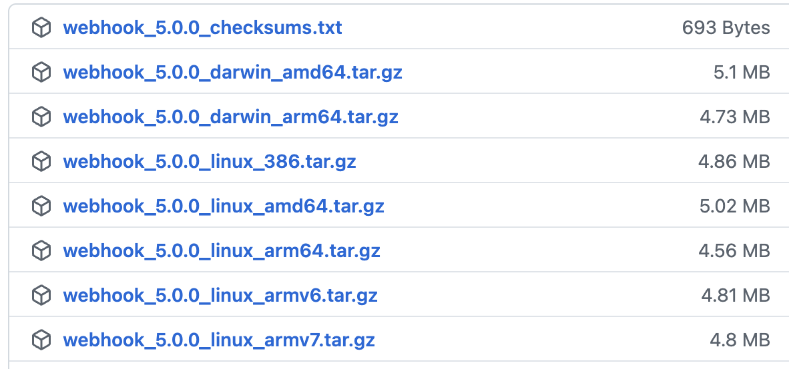
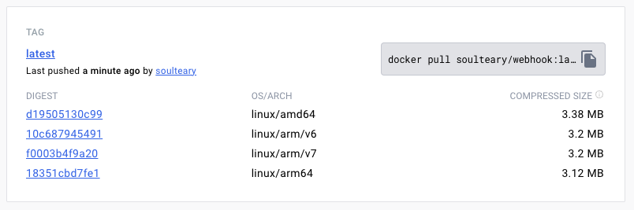

# Welcome to WebHook! [中文文档](./README-zhCN.md)

[](https://github.com/soulteary/webhook/actions/workflows/build.yml) [](https://github.com/soulteary/webhook/actions/workflows/codeql.yml) [](https://github.com/soulteary/webhook/actions/workflows/scan.yml) [](https://github.com/soulteary/webhook/actions/workflows/benchmark.yml) [](.github/goreportcard-report.md)


 
 
 **WebHook** is a hardened and observable webhook-to-command runner for self-hosted, edge, and private-network environments. It keeps compatibility with [adnanh/webhook](https://github.com/adnanh/webhook) hook definitions while adding production controls for command execution, traffic, auditing, and telemetry.

## ✨ Key Features

- 🔒 **Security First**: Command path whitelisting, argument validation, strict mode, and secure logging
- ⚡ **High Performance**: Configurable concurrency, rate limiting (including Redis-backed distributed), and optimized request handling
- 🎯 **Flexible Configuration**: Support for JSON and YAML configuration files with Go template support
- 🔐 **Advanced Authentication**: Multiple trigger rule types including HMAC signature validation, IP whitelisting, and custom rules
- 📊 **Observability**: Built-in Prometheus metrics, health check endpoint, optional OpenAPI spec (for Swagger/client generation), OpenTelemetry tracing, audit logging, and comprehensive logging
- 🐳 **Container Ready**: Official Docker images with multiple variants
- 🌍 **Internationalization**: Full support for English and Chinese documentation
- 🔄 **Hot Reload**: Update hook configurations without restarting the server

## 🚀 Use Cases

- **CI/CD Automation**: Automatically deploy applications when code is pushed to specific branches
- **Service Integration**: Connect GitHub, GitLab, Gitea, and other services to your infrastructure
- **ChatOps**: Integrate with Slack, Discord, or other messaging platforms to run commands via chat
- **Monitoring & Alerts**: Trigger automated responses to system events and alerts
- **Custom Workflows**: Build custom automation workflows tailored to your needs

## 🎯 How It Works

WebHook follows a simple, focused approach:

1. **Receive** HTTP requests (GET, POST, etc.)
2. **Parse** request headers, body, and parameters
3. **Validate** trigger rules and conditions
4. **Execute** configured commands with request data passed as arguments or environment variables

The commands you execute are entirely up to you - from simple scripts to complex automation workflows.

## Compatibility and Scope

| Area | Compatibility / behavior |
|---|---|
| Hook definitions | Existing adnanh/webhook JSON and YAML definitions are a compatibility target and should normally load unchanged. Validate before every upgrade. |
| Historical defaults | The default `compat` profile preserves the existing permissive HTTP-method and opt-in security behavior. |
| Production defaults | `-profile secure` enables POST-only hooks, strict argument checks, rate limiting, request IDs, and audit logging; it also requires `-allowed-command-paths`. |
| Deliberate boundary | WebHook controls local command execution. It is not a durable delivery platform and does not promise persistent queues, retries, DLQs, or restart recovery. |

# 🚀 Quick Start

Get up and running with WebHook in minutes.

## Installation

### Option 1: Homebrew or Go install

```bash
brew install soulteary/tap/webhook

# Or install directly with the Go toolchain
go install github.com/soulteary/webhook@latest
```

### Option 2: Pre-built Binaries

[](https://github.com/soulteary/webhook/releases)

Download pre-built binaries for Linux and macOS from the [Releases page](https://github.com/soulteary/webhook/releases).

### Option 3: Docker



```bash
# Latest stable version
docker pull soulteary/webhook:latest

# Specific version
docker pull soulteary/webhook:7.1.0

# Extended version with debugging tools
docker pull soulteary/webhook:extend-7.1.0
```

Both release variants run as non-root from `/var/lib/webhook`. The default image is a `scratch`-based core image: use it for mounted static executables and configurations that do not need a shell. The `extend-*` image includes Alpine, Bash, curl, wget, jq, and yq and is the appropriate variant for shell-script hooks. Ensure mounted hooks, commands, and audit paths are readable or writable by UID/GID `65532`.

For a signed request you can run immediately, use the [60-second Docker Compose quickstart](example/quickstart/).

### Option 4: Build from Source

```bash
git clone https://github.com/soulteary/webhook.git
cd webhook
go build
```

## Configuration

**📚 For complete documentation, see the [versioned documentation site](https://soulteary.github.io/webhook/), [English Documentation](./docs/en-US/), or [Chinese Documentation](./docs/zh-CN/).**

Create, validate, and diagnose a configuration before starting the server:

```bash
webhook init
WEBHOOK_SECRET='replace-with-a-random-secret' webhook validate --strict -template -hooks hooks/hooks.yaml
WEBHOOK_SECRET='replace-with-a-random-secret' webhook doctor --strict -template -hooks hooks/hooks.yaml
```

The [Hook JSON Schema](schema/hooks.schema.json) enables editor completion and unknown-field detection. See [Configuration tools](docs/en-US/Configuration-Tools.md) for VS Code setup and command details.

### Basic Example

By default, webhook scans config files from the `./hooks` directory. Create `./hooks/hooks.yaml` (or `./hooks/hooks.json`) to define your webhooks:

**Example: Simple Deployment Hook**

```json
[
  {
    "id": "redeploy-webhook",
    "execute-command": "/var/scripts/redeploy.sh",
    "command-working-directory": "/var/webhook"
  }
]
```

If you prefer YAML, the equivalent `hooks.yaml` file would look like this:

```yaml
- id: redeploy-webhook
  execute-command: "/var/scripts/redeploy.sh"
  command-working-directory: "/var/webhook"
```

### Running WebHook (default directory mode)

```bash
./webhook -verbose
```

The server will start on port `9000` by default. Your hook will be available at:

```
http://yourserver:9000/hooks/redeploy-webhook
```

Single-file mode is still supported when explicitly set:

```bash
./webhook -hooks hooks.json -verbose
```

### Securing Your Hooks

**Important**: The example above has no authentication. Always use trigger rules in production!

**Example: Secure Hook with an HMAC Header**

```json
[
  {
    "id": "secure-deploy",
    "execute-command": "/var/scripts/deploy.sh",
    "http-methods": ["POST"],
    "trigger-rule": {
      "match": {
        "type": "payload-hmac-sha256",
        "secret": "replace-with-a-long-random-secret",
        "parameter": {
          "source": "header",
          "name": "X-Webhook-Signature"
        }
      }
    }
  }
]
```

Start with the secure profile (the command allowlist is mandatory for this profile):

```bash
./webhook -profile secure \
  -allowed-command-paths=/var/scripts \
  -hooks hooks.json
```

Send the exact request body with `X-Webhook-Signature: sha256=<hex HMAC-SHA256>`. Prefer loading the secret from an environment variable through a [configuration template](docs/en-US/Templates.md) instead of committing it. Unlike query-string tokens, the signature is not copied into URLs, access logs, or browser history.

For more security options, see:
- [Security Best Practices](docs/en-US/Security-Best-Practices.md) - Comprehensive security guide
- [Hook Rules](docs/en-US/Hook-Rules.md) - All available trigger rules
- [Security Policy](SECURITY.md) - Built-in security features

## Additional Features

- **Form Data Support**: Parse multipart form data and file uploads - see [Form Data](docs/en-US/Referencing-Request-Values.md)
- **Template Support**: Use Go templates in configuration files with `-template` flag - see [Templates](docs/en-US/Templates.md)
- **Config UI**: Same binary, behavior by flags. Enable config generator Web UI with `-config-ui` (recommend debugging or intranet only). It runs on the same server port (default `9000`) and can be mounted with `-config-ui-path` (trailing slash normalized). In directory mode (default `./hooks` or explicit `-hooks-dir`), the UI can save generated configs directly to that directory and you can validate by calling the generated endpoint immediately after save. In explicit single-file mode (`-hooks`), generation/download still works but save-to-directory is not exposed. The `-urlprefix` value is used for the call URL shown in the UI. See [Webhook Parameters](docs/en-US/Webhook-Parameters.md) and [Config UI](cmd/README.md).
- **OwlMail integration**: Receive signed email events from [OwlMail](https://github.com/soulteary/owlmail), verify the request body with HMAC-SHA256, map delivery metadata for correlation, and run controlled commands. See the [integration guide](docs/en-US/OwlMail-Integration.md) and [runnable example](example/owlmail/).
- **Provider recipes**: CI-verified GitHub, GitLab, Gitea, Harbor, and Alertmanager configurations are available in [example/providers](example/providers/).
- **HTTPS**: Use a reverse proxy (nginx, Traefik, Caddy) for HTTPS support
- **CORS**: Set custom headers including CORS headers with `-header name=value`
- **Hot Reload**: Update configurations without restarting using `-hotreload` or `kill -USR1`

For more examples and use cases, check out [Hook Examples](docs/en-US/Hook-Examples.md). Example configs and setups (hooks, Lark, multi-webhook, and OwlMail) are in the [example/](example/) directory.

## Documentation

### Core Documentation
- [Hook Definition](docs/en-US/Hook-Definition.md) - Complete hook configuration reference
- [Config UI](cmd/README.md) - Config generator (enable with `go run . -config-ui`)
- [OwlMail Integration](docs/en-US/OwlMail-Integration.md) - Signed email-event forwarding with a runnable Compose example
- [Hook Rules](docs/en-US/Hook-Rules.md) - Trigger rules and conditions
- [Webhook Parameters](docs/en-US/Webhook-Parameters.md) - Command-line arguments and configuration
- [Templates](docs/en-US/Templates.md) - Using Go templates in configurations
- [Referencing Request Values](docs/en-US/Referencing-Request-Values.md) - Accessing request data
- [Hook Examples](docs/en-US/Hook-Examples.md) - Practical examples and use cases

### Advanced Topics
- [API Reference](docs/en-US/API-Reference.md) - Complete API documentation with all endpoints
- [Security Best Practices](docs/en-US/Security-Best-Practices.md) - Comprehensive security guide
- [Performance Tuning](docs/en-US/Performance-Tuning.md) - Performance optimization guide
- [Testing Guide](docs/en-US/Testing-Guide.md) - How to run tests, generate coverage reports, and key testing scenarios
- [Troubleshooting](docs/en-US/Troubleshooting.md) - Common issues and solutions
- [Migration Guide](docs/en-US/Migration-Guide.md) - Upgrading from previous versions

### Security
- [Security Policy](SECURITY.md) - Security features and vulnerability reporting

### Release Integrity

Tagged releases publish SPDX SBOMs, a keyless Sigstore bundle for the checksum file, signed multi-architecture container manifests, and GitHub build-provenance attestations. Examples:

```bash
gh attestation verify webhook_7.1.0_linux_amd64.tar.gz -R soulteary/webhook

cosign verify-blob \
  --bundle webhook_7.1.0_checksums.txt.sigstore.json \
  --certificate-identity-regexp='^https://github.com/soulteary/webhook/.github/workflows/build.yml@refs/tags/.+$' \
  --certificate-oidc-issuer='https://token.actions.githubusercontent.com' \
  webhook_7.1.0_checksums.txt
```

## About This Fork

This project is a maintained fork of the original [webhook](https://github.com/adnanh/webhook) project. Current supported versions are 7.x; see [SECURITY.md](SECURITY.md) for the version support table.

The fork is focused on:

- **Security**: Regular security updates, vulnerability fixes, and enhanced security features
- **Maintenance**: Active development, dependency updates, and bug fixes
- **Features**: Community-driven improvements and new features
- **Documentation**: Comprehensive documentation in both English and Chinese

We aim to provide a reliable, secure, and well-maintained webhook server for the community.

[w]: https://github.com/soulteary/webhook
